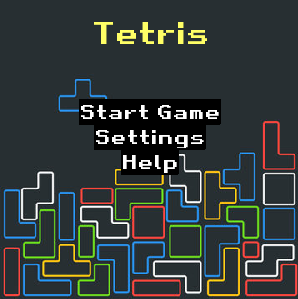
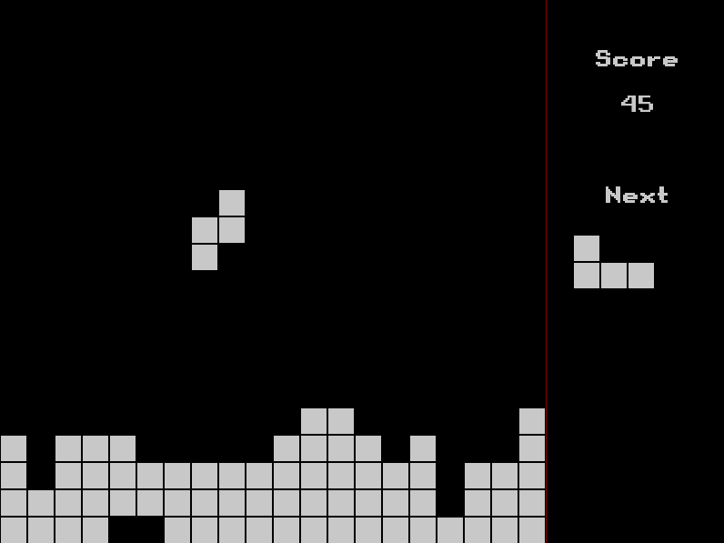
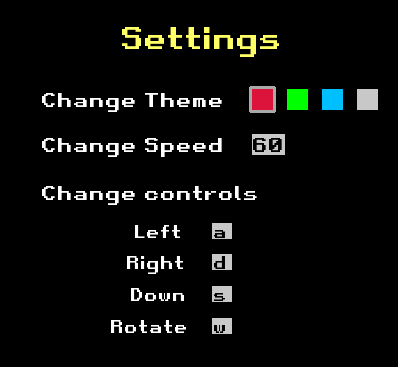
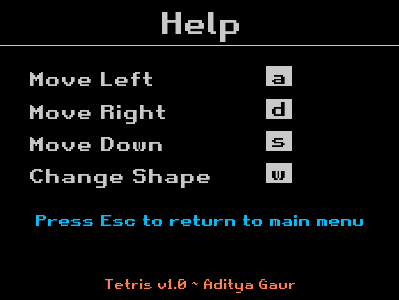

# TETRIS v1.0

*Remake of classic Tetris with a few tweaks.*

To play keep the blocks from piling to the top and score points by completing horizontal lines of blocks, and last as long as you can!

## Requirements:

- [Python 3](https://www.python.org/downloads/)

- [Pygame](https://www.pygame.org/download.shtml) which can be easily installed after installing python with the command -

```
pip3 install pygame
```
or in case that doesn't work
```
python3 -m pip3 install pygame
```

## Description:

### 1. ***Main screen***



When you run the program, you firstly encounter the main screen from where you can jump to help or settings or you can just dive into the game itself

To exit simply use the close button specific to your operating system.

### 2. ***Game window***



Complete horizontal lines to score points and make use of the next block feature,but beware of stacking the blocks till the top as it would result in you losing the game.

Try to score as many points as you can!

You can press Esc to return to the main menu.

### 3. ***Settings***



**You can change-**

- the theme of the game by selecting one of the colored blocks.
- the speed at which blocks fall by typing into the no. box
- the controls which toggle user actions by selecting a box and then pressing the key which you want to be the new control

### 4. ***Help***



*[For Default settings]*

You can - 
- move a block left with the 'a' key
- move a block right with the 'd' key
- move a block down with the 's' key
- rotate a block about the axis with 'w' key on your keyboard.

## Extra Functionalities:

> Features which you can use by changing the code but are not provided in the gui.

### 1. Adding blocks of your own -

You can add a custom block by making a new global variable with the following syntax - 

```python3
var_name = [[0, 1, 1, 0,
             0, 0, 1, 0,
             0, 0, 1, 0,
             0, 0, 1, 1]]
```

Where 1 shows a block in a 4x4 grid. You can also add the state of block if rotate key is pressed by adding another list in the list of lists.

After adding the var you need to update it in the main() function at the line -

```python3
def main():
    `snip`
    next_s = random.choice([S, Z, T, O, I, J, L, var_name])
    `snip`
            next_s = random.choice([S, Z, T, O, I, J, L, var_name])

```

### 2. Change the default speed/color - 

You can change the default speed by editing -

```python3
SPEED = 60  # Change 60 with desired speed
```

You can change the default color by editing -

```python3
SELECTED_color = WHITE  # Change white with the rgb tuple of your color like (200, 200, 200)
```

#### Video Demo: https://youtu.be/WKo7ALQHhec
